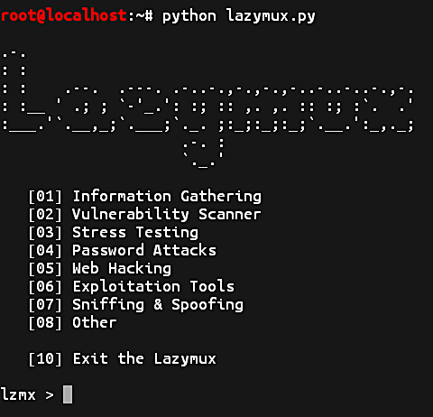

# Lazymux
Lazymux tools installer is very easy to use, only provided for lazy termux users.

## Screenshot


### Requirements
• Linux environment (For all features work perfectly)<br>
• Python 2.x<br>
• git<br>

#### Installation and Using Lazymux
```shell
git clone https://github.com/Gameye98/Lazymux
 
cd Lazymux
 
sh install.sh 
# OR
./install.sh
```